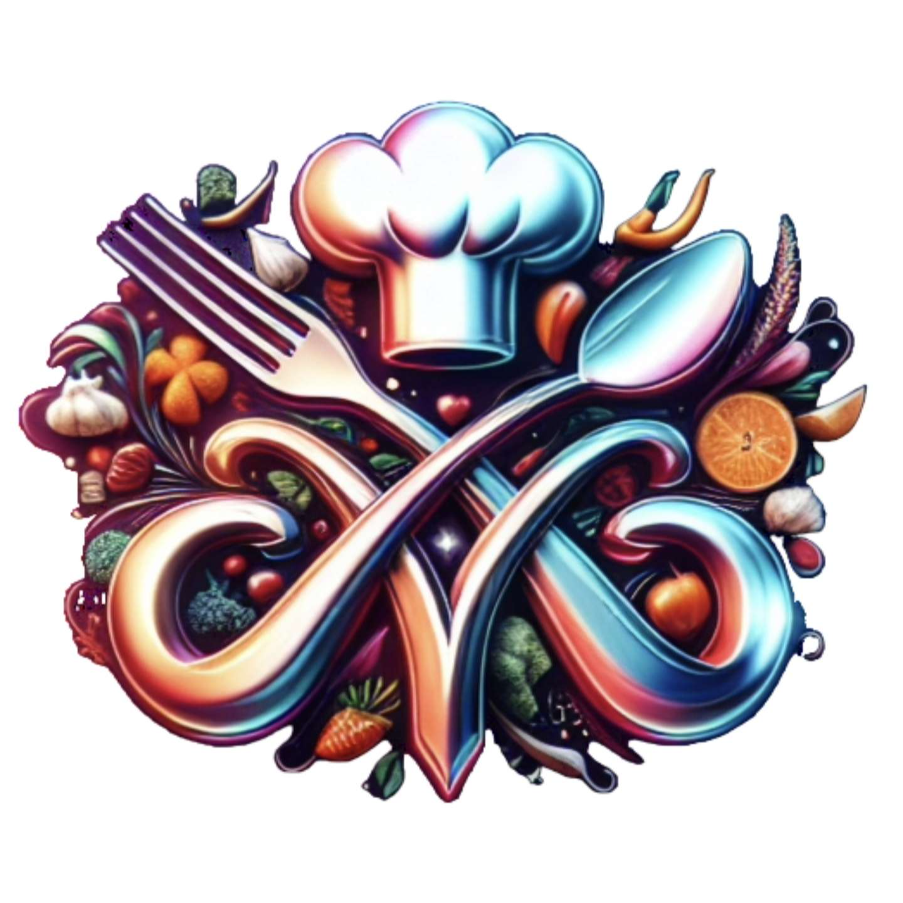
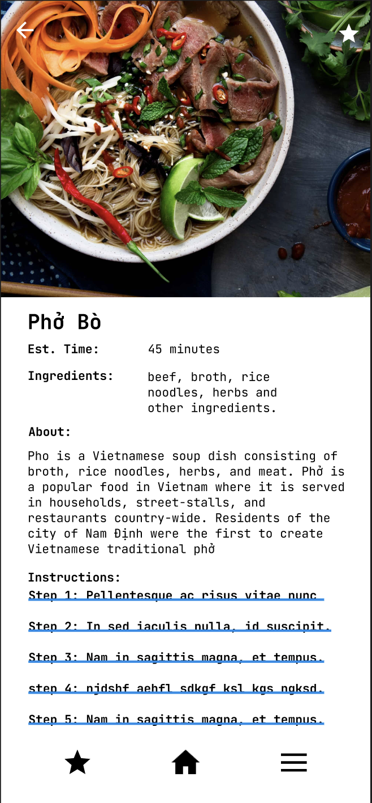
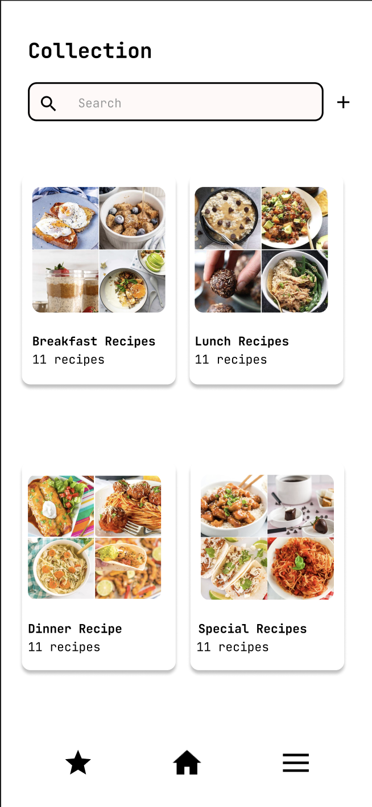
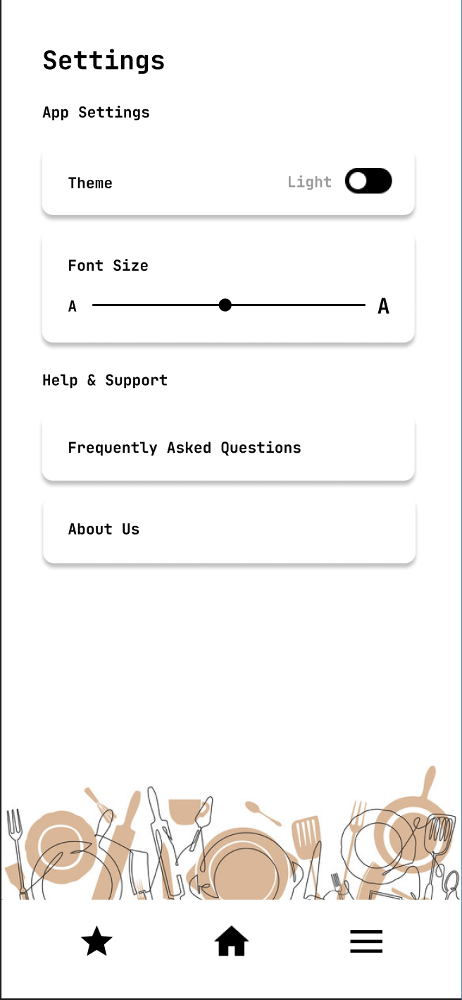
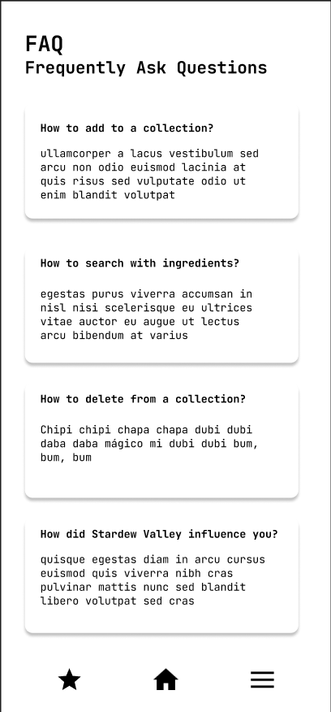

<!-- Improved compatibility of back to top link: See: https://github.com/othneildrew/Best-README-Template/pull/73 -->
<a name="Dish Wish"></a>
<!--
*** Thanks for checking out the Best-README-Template. If you have a suggestion
*** that would make this better, please fork the repo and create a pull request
*** or simply open an issue with the tag "enhancement".
*** Don't forget to give the project a star!
*** Thanks again! Now go create something AMAZING! :D
-->

<!-- PROJECT LOGO -->
<br />
<div align="center">
  <a href="https://github.com/Christine-Bui/Dish-Wish">
    
  </a>

<h3 align="center">Dish Wish</h3>

  <p align="center">
    <em> Need a dish, we grant that wish </em>
    <br />
    <a href="https://github.com/Christine-Bui/Dish-Wish"><strong>Explore the docs »</strong></a>
    <br />
    <br />
    <a href="https://github.com/Christine-Bui/Dish-Wish">View Demo</a>
    ·
    <a href="https://github.com/Christine-Bui/Dish-Wish/issues">Report Bug</a>
    ·
    <a href="https://github.com/Christine-Bui/Dish-Wish/issues">Request Feature</a>
  </p>
</div>

<!-- PROJECT SHIELDS -->
<!--
*** I'm using markdown "reference style" links for readability.
*** Reference links are enclosed in brackets [ ] instead of parentheses ( ).
*** See the bottom of this document for the declaration of the reference variables
*** for contributors-url, forks-url, etc. This is an optional, concise syntax you may use.
*** https://www.markdownguide.org/basic-syntax/#reference-style-links
-->
<div align="center">

[![Contributors][contributors-shield]][contributors-url]
[![Forks][forks-shield]][forks-url]
[![Stargazers][stars-shield]][stars-url]
[![Issues][issues-shield]][issues-url]
[![MIT License][license-shield]][license-url]
</div>


<!-- TABLE OF CONTENTS -->
<details>
  <summary>Table of Contents</summary>
  <ol>
    <li>
      <a href="#about-the-project">About The Project</a>
      <ul>
        <li><a href="#high-fidelity-design">High Fidelity Design</a></li>
          <ul>
            <li><a href="#light-mode">Light Mode</a></li>
            <li><a href="#dark-mode">Dark Mode</a></li>
          </ul>
        <li><a href="#built-with">Built With</a></li>
      </ul>
    </li>
    <li>
      <a href="#getting-started">Getting Started</a>
      <ul>
        <li><a href="#prerequisites">Prerequisites</a></li>
        <li><a href="#installation">Installation</a></li>
      </ul>
    </li>
    <li><a href="#usage">Usage</a></li>
    <li><a href="#roadmap">Roadmap</a></li>
    <li><a href="#license">License</a></li>
    <li><a href="#contact">Contact</a></li>
    <li><a href="#acknowledgments">Acknowledgments</a></li>
  </ol>
</details>


<!-- ABOUT THE PROJECT -->
## About The Project

We wanted to solve a problem of what to make when you have limited resources. So we came up with the idea of creating a mobile app that allows the user to input the ingredients available and it will provide the user with possible recipes of food they can make with those ingredients.

<p align="right">(<a href="#readme-top">back to top</a>)</p>

### High Fidelity Design
#### Light Mode
<table>
  <tr>
    <td></td>
    <td></td>
    <td></td>
    <td></td>
  </tr>
  <tr>
    <td></td>
    <td></td>
    <td></td>
    <td></td>
  </tr>
  <tr>
    <td></td>
    <td></td>
    <td></td>
  </tr>
</table>

#### Dark Mode
<table>
  <tr>
    <td></td>
    <td></td>
    <td></td>
    <td></td>
  </tr>
  <tr>
    <td></td>
    <td></td>
    <td></td>
    <td></td>
  </tr>
  <tr>
    <td></td>
    <td></td>
    <td></td>
  </tr>
</table>
<br>

### Built With

[![C++][C++]][C++-url] [![CMake][CMake]][CMake-url] [![Swift][Swift]][Swift-url] [![Dart][Dart]][Dart-url] [![C][C]][C-url] [![HTML5][HTML5]][HTML5-url]

<p align="right">(<a href="#about-the-project">back to top</a>)</p>


<!-- GETTING STARTED -->
## Getting Started

This is an example of how you may give instructions on setting up your project locally.
To get a local copy up and running follow these simple example steps.

### Prerequisites

This is an example of how to list things you need to use the software and how to install them.
* npm
  ```sh
  npm install npm@latest -g
  ```

### Installation

1. Get a free API Key at [https://example.com](https://example.com)
2. Clone the repo
   ```sh
   git clone https://github.com/Christine-Bui/Dish-Wish.git
   ```
3. Install NPM packages
   ```sh
   npm install
   ```
4. Enter your API in `config.js`
   ```js
   const API_KEY = 'ENTER YOUR API';
   ```

<p align="right">(<a href="#about-the-project">back to top</a>)</p>


<!-- USAGE EXAMPLES -->
## Usage

Use this space to show useful examples of how a project can be used. Additional screenshots, code examples and demos work well in this space. You may also link to more resources.

_For more examples, please refer to the [Documentation](https://example.com)_

<p align="right">(<a href="#about-the-project">back to top</a>)</p>


<!-- ROADMAP -->
## Roadmap

- [ ] Loading Screen
- [ ] Bottom Navigation Bar
    - [ ] Saved button
    - [ ] Home button
    - [ ] More button
- [ ] Home screen
    - [ ] Search Bar
    - [ ] Horizontal Scroll List Views
    - [ ] Vertical scrolls for sections recommended for you, popular dishes, and your collections
- [ ] Filter Pop-up Dialog Page
    - [ ] By ingredients button
    - [ ] By recipe button
- [ ] Search by ingredients option
    - [ ] Vertical scroll list view of ingredients (alphabet order, matches user input, checkboxes)
- [ ] Search by recipe
    - [ ] Vertical card view of recipes (top: most relevant, after: similar)
    - [ ] Star option to save
- [ ] Recipe Page
    - [ ] Back button
    - [ ] Star option to save
    - [ ] Vertical scroll for recipe content
- [ ] Collection Page
    - [ ] Search bar
    - [ ] Add collection button
    - [ ] Card view of groups of recipes saved
- [ ] Settings Page
    - [ ] Theme toggle for dark or light mode
    - [ ] Slider for adjusting font size
    - [ ] Buttons for FAQ and About us pages
- [ ] Recently Viewed Page
    - [ ] Vertical Scroll List view of recipes
- [ ] FAQ
    - [ ] Vertical scroll list view of questions and answers
- [ ] About Us page
- [ ] Delete/Edit option with long press

See the [open issues](https://github.com/Christine-Bui/Dish-Wish/issues) for a full list of proposed features (and known issues).

<p align="right">(<a href="#about-the-project">back to top</a>)</p>


<!-- LICENSE -->
## License


<p align="right">(<a href="#about-the-project">back to top</a>)</p>


<!-- CONTACT -->
## Contact

<a href="https://www.linkedin.com/in/jeet-patel-csulb"> </a>
<a href="https://www.linkedin.com/in/christine-bui-csulb" > </a><br>

<p align="right">(<a href="#about-the-project">back to top</a>)</p>


<!-- ACKNOWLEDGMENTS -->
## Acknowledgments

* []()
* []()
* []()

<p align="right">(<a href="#about-the-project">back to top</a>)</p>


<!-- MARKDOWN LINKS & IMAGES -->
<!-- https://www.markdownguide.org/basic-syntax/#reference-style-links -->
[contributors-shield]: https://img.shields.io/github/contributors/Christine-Bui/Dish-Wish.svg?style=for-the-badge
[contributors-url]: https://github.com/Christine-Bui/Dish-Wish/graphs/contributors
[forks-shield]: https://img.shields.io/github/forks/Christine-Bui/Dish-Wish.svg?style=for-the-badge
[forks-url]: https://github.com/Christine-Bui/Dish-Wish/network/members
[stars-shield]: https://img.shields.io/github/stars/Christine-Bui/Dish-Wish.svg?style=for-the-badge
[stars-url]: https://github.com/Christine-Bui/Dish-Wish/stargazers
[issues-shield]: https://img.shields.io/github/issues/Christine-Bui/Dish-Wish.svg?style=for-the-badge
[issues-url]: https://github.com/Christine-Bui/Dish-Wish/issues
[license-shield]: https://img.shields.io/github/license/Christine-Bui/Dish-Wish.svg?style=for-the-badge
[license-url]: https://github.com/Christine-Bui/Dish-Wish/blob/master/LICENSE.txt
[linkedin-shield]: https://img.shields.io/badge/-LinkedIn-black.svg?style=for-the-badge&logo=linkedin&colorB=555
[linkedin-url]: https://linkedin.com/in/christine-bui-csulb
[product-screenshot]: images/screenshot.png
[C++]: https://img.shields.io/badge/C++-2CA5E0?style=for-the-badge&logo=cplusplus&logoColor=white"
[C++-url]: https://cplusplus.com/
[CMake]: https://img.shields.io/badge/CMake-%23008FBA.svg?style=for-the-badge&logo=cmake&logoColor=white
[CMake-url]: https://cmake.org/
[Swift]: https://img.shields.io/badge/Swift-FA7343?style=for-the-badge&logo=swift&logoColor=white
[Swift-url]: https://www.swift.org/
[Dart]: https://img.shields.io/badge/Dart-0175C2?style=for-the-badge&logo=dart&logoColor=white
[Dart-url]: https://angular.io/
[C]: https://img.shields.io/badge/c-%2300599C.svg?style=for-the-badge&logo=c&logoColor=white
[C-url]: https://
[HTML5]: https://img.shields.io/badge/HTML5-E34F26?style=for-the-badge&logo=html5&logoColor=white
[HTML5-url]: https://

